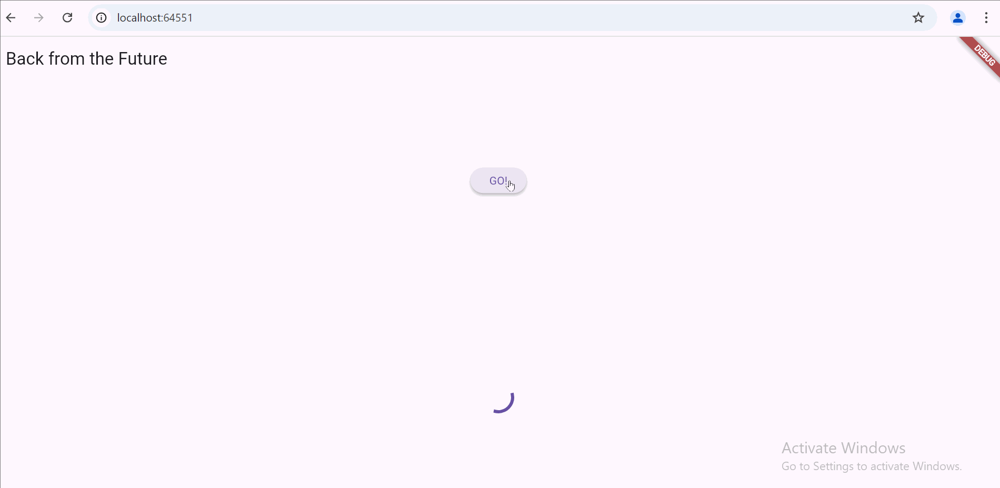
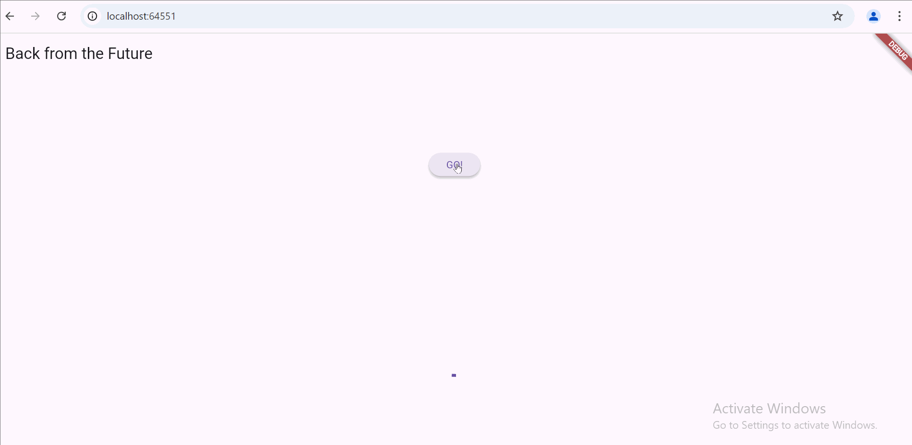
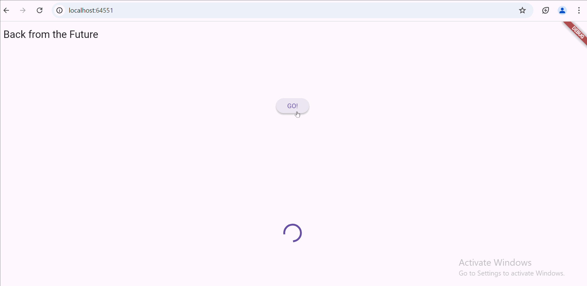

Nama : Shinta Yulistiana
NIM : 362358302076
Kelas : 2A TRPL

#11 | Pemrograman Asynchronous

**Praktikum 1: Mengunduh Data dari Web Service (API)**

Langkah 1: Buat Project Baru
Menambahkan dependensi http dengan mengetik perintah flutter pub add http.

Langkah 2: Cek file pubspec.yaml

Langkah 3: Buka file main.dart

Mengetik kode dan menambahkan nama panggilan pada title app sebagai identitas hasil pekerjaan.

Langkah 4: Tambah method getData()

Langkah 5: Tambah kode di ElevatedButton

Maksud kode langkah 5 tersebut terkait substring dan catchError

- substring(0, 450) digunakan untuk membatasi data dari API agar hanya menampilkan 450 karakter pertama agar data yang ditampilkan pada UI tidak terlalu panjang.
- catchError digunakan untuk menangani error yang mungkin akan terjadi saat memanggil fungsi getData(). Jika terjadi error, maka blok yang ada di catchError akan dijalankan untuk memastikan aplikasi tidak crash.
  

**Praktikum 2: Menggunakan await/async untuk menghindari callbacks**

Langkah 1: Buka file main.dart

Menambahkan tiga method berisi kode seperti berikut di dalam class \_FuturePageState.

Langkah 2: Tambah method count()

Langkah 3: Panggil count()

Langkah 4: Run

Maksud kode langkah 1 dan 2

- Maksud kode langkah 1 adalah mendefinisikan tiga metode asynchronous masing-masing mengembalikan angka setelah 3 detik. Future.delayed digunakan untuk penundaan (delay) dalam simulasi pemanggilan API yang memerlukan waktu untuk merespon.
- Maksud kode langkah 2 adalah mendefinisikan sebuah metode count() yang akan memanggil ketiga fungsi yang telah didefinisikan sebelumnya dan menghitung totalnya.count() akan menunggu hasil dari returnOneAsync(), returnTwoAsync(), returnThreeAsync() yang setelah 3 detik akan mengembalikan angka 1, 2, dan 3 lalu nilai kemudian ditambahkan ke total. Setelah ketiga nilai dijumlah, setState dipanggil untuk memperbarui UI dengan nilai total yang baru dihitung. total diubah menjadi tipe String agar dapat ditampilkan dalam widget Text.
- 

**Praktikum 3: Menggunakan Completer di Future**

Langkah 1: Buka main.dart

Langkah 2: Tambahkan variabel dan method

Langkah 3: Ganti isi kode onPressed()

Langkah 4:

- Maksud kode langkah 2 adalah mendefinisikan 2 fungsi yaitu getNumber() dan calculate() yang berfungsi untuk mengatur pengembalian nilai dengan mengunakan Completer dalam Dart yang digunakan untuk menangani nilai yang akan datang (asynchronous) yang memungkinkan untuk kapan dan bagaimana nilai tersebut diselesaikan dan dikembalikan dalam operasi asynchronous.
- 

Langkah 5: Ganti method calculate()

Langkah 6: Pindah ke onPressed()

Mengganti kode

- Maksud perbedaan kode langkah 2 dengan langkah 5-6 adalah langkah 2 hanya menangani penyelesaian normal tanpa mempertimbangkan kemungkinan error sementara langkah 5 dan 6 menambah kemampuan untuk menangani kesalahan dengan baik dalam proses asynchronous.
- 

**Praktikum 4: Memanggil Future secara paralel**

Langkah 1: Buka file main.dart

Menambahkan method ke dalam class \_FuturePageState

Langkah 2: Edit onPressed()

Langkah 3: Run

Langkah 4: Ganti variabel futureGroup

Maksud perbedaan kode langkah 1 dan 4

- Pada langkah 1 menggunakan FutureGroup, lebih fleksibel dan memungkinkan untuk menangani grup Future secara lebih eksplisit dan kompleks, meskipun lebih rumit.
- Pada langkah 4 menggunakan Future.wait, lebih sederhana dan lebih mudah dipahami untuk skenario dasar dimana hanya ingin menunggu beberapa Future untuk menyelesaikan dan mendapatkan hasilnya secara bersamaan dalam bentuk List.

