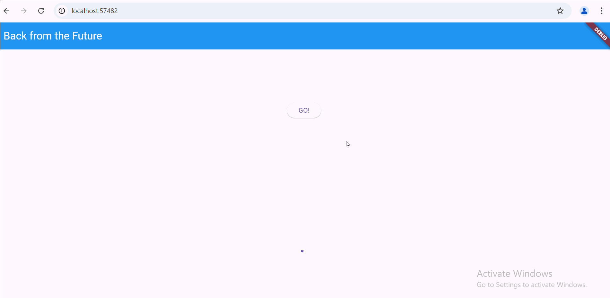
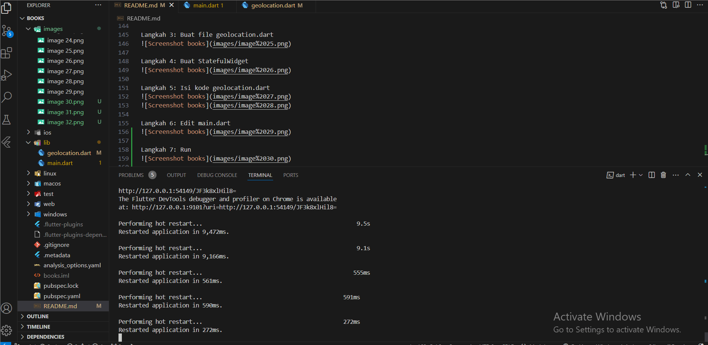
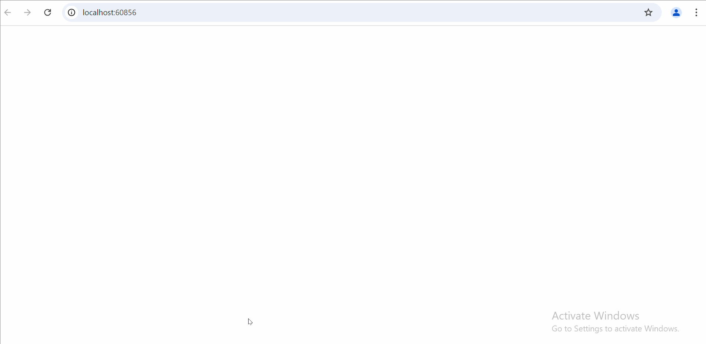

Nama : Shinta Yulistiana
NIM : 362358302076
Kelas : 2A TRPL

#11 | Pemrograman Asynchronous

**Praktikum 1: Mengunduh Data dari Web Service (API)**

Langkah 1: Buat Project Baru
Menambahkan dependensi http dengan mengetik perintah flutter pub add http.

Langkah 2: Cek file pubspec.yaml

Langkah 3: Buka file main.dart

Mengetik kode dan menambahkan nama panggilan pada title app sebagai identitas hasil pekerjaan.

**Soal 1**

Langkah 4: Tambah method getData()

**Soal 2**

Langkah 5: Tambah kode di ElevatedButton

Maksud kode langkah 5 tersebut terkait substring dan catchError

**Soal 3**
- substring(0, 450) digunakan untuk membatasi data dari API agar hanya menampilkan 450 karakter pertama agar data yang ditampilkan pada UI tidak terlalu panjang.
- catchError digunakan untuk menangani error yang mungkin akan terjadi saat memanggil fungsi getData(). Jika terjadi error, maka blok yang ada di catchError akan dijalankan untuk memastikan aplikasi tidak crash.
  

**Praktikum 2: Menggunakan await/async untuk menghindari callbacks**

Langkah 1: Buka file main.dart

Menambahkan tiga method berisi kode seperti berikut di dalam class \_FuturePageState.

Langkah 2: Tambah method count()

Langkah 3: Panggil count()

Langkah 4: Run

**Soal 4**
Maksud kode langkah 1 dan 2

- Maksud kode langkah 1 adalah mendefinisikan tiga metode asynchronous masing-masing mengembalikan angka setelah 3 detik. Future.delayed digunakan untuk penundaan (delay) dalam simulasi pemanggilan API yang memerlukan waktu untuk merespon.
- Maksud kode langkah 2 adalah mendefinisikan sebuah metode count() yang akan memanggil ketiga fungsi yang telah didefinisikan sebelumnya dan menghitung totalnya.count() akan menunggu hasil dari returnOneAsync(), returnTwoAsync(), returnThreeAsync() yang setelah 3 detik akan mengembalikan angka 1, 2, dan 3 lalu nilai kemudian ditambahkan ke total. Setelah ketiga nilai dijumlah, setState dipanggil untuk memperbarui UI dengan nilai total yang baru dihitung. total diubah menjadi tipe String agar dapat ditampilkan dalam widget Text.
- 

**Praktikum 3: Menggunakan Completer di Future**

Langkah 1: Buka main.dart

Langkah 2: Tambahkan variabel dan method

Langkah 3: Ganti isi kode onPressed()

Langkah 4:

**Soal 5**
- Maksud kode langkah 2 adalah mendefinisikan 2 fungsi yaitu getNumber() dan calculate() yang berfungsi untuk mengatur pengembalian nilai dengan mengunakan Completer dalam Dart yang digunakan untuk menangani nilai yang akan datang (asynchronous) yang memungkinkan untuk kapan dan bagaimana nilai tersebut diselesaikan dan dikembalikan dalam operasi asynchronous.
- 

Langkah 5: Ganti method calculate()

Langkah 6: Pindah ke onPressed()

Mengganti kode

**Soal 6**
- Maksud perbedaan kode langkah 2 dengan langkah 5-6 adalah langkah 2 hanya menangani penyelesaian normal tanpa mempertimbangkan kemungkinan error sementara langkah 5 dan 6 menambah kemampuan untuk menangani kesalahan dengan baik dalam proses asynchronous.
- 

**Praktikum 4: Memanggil Future secara paralel**

Langkah 1: Buka file main.dart

Menambahkan method ke dalam class \_FuturePageState

Langkah 2: Edit onPressed()

Langkah 3: Run
**Soal 7**

Langkah 4: Ganti variabel futureGroup

**Soal 8**
Maksud perbedaan kode langkah 1 dan 4

- Pada langkah 1 menggunakan FutureGroup, lebih fleksibel dan memungkinkan untuk menangani grup Future secara lebih eksplisit dan kompleks, meskipun lebih rumit.
- Pada langkah 4 menggunakan Future.wait, lebih sederhana dan lebih mudah dipahami untuk skenario dasar dimana hanya ingin menunggu beberapa Future untuk menyelesaikan dan mendapatkan hasilnya secara bersamaan dalam bentuk List.

**Praktikum 5: Menangani Respon Error pada Async Code**

Langkah 1: Buka file main.dart

Menambahkan method ke dalam class \_FuturePageState

Langkah 2: ElevatedButton

Mengganti kode

Langkah 3: Run

**Soal 9**

Langkah 4: Tambah method handleError()

Menambahkan kode di dalam class \_FutureStatePage

**Soal 10**
Panggil method handleError() tersebut di ElevatedButton, lalu run. Apa hasilnya? Jelaskan perbedaan kode langkah 1 dan 4!

- Hasilnya adalah setelah 2 detik maka akan muncul **Something terrible happened!**
- Langkah 1: returnError

Simpel dan hanya mensimulasikan error tanpa menangani apa pun dan membutuhkan error handling tambahan oleh pemanggil fungsi.

- Langkah 4: handleError

Menggabungkan pemanggilan fungsi returnError dengan logika error handling dan eksekusi akhir. Lebih lengkap dan siap pakai, terutama untuk memperbarui UI berdasarkan hasil eksekusi fungsi.

**Praktikum 6: Menggunakan Future dengan StatefulWidget**

Langkah 1: install plugin geolocator

Langkah 2: Tambah permission GPS

Langkah 3: Buat file geolocation.dart

Langkah 4: Buat StatefulWidget

Langkah 5: Isi kode geolocation.dart

**Soal 11**

Langkah 6: Edit main.dart

Langkah 7: Run

Langkah 8: Tambahkan animasi loading

**Soal 12**
- Jika Anda tidak melihat animasi loading tampil, kemungkinan itu berjalan sangat cepat. Tambahkan delay pada method getPosition() dengan kode await Future.delayed(const Duration(seconds: 3));
  
- Apakah Anda mendapatkan koordinat GPS ketika run di browser? Mengapa demikian?
  Karena penggunaan Geolocator.requestPermission(); yang akan memunculkan prompt untuk meminta izin dari pengguna untuk memberikan data lokasi pada aplikasi.
- 

**Praktikum 7: Manajemen Future dengan FutureBuilder**

Langkah 1: Modifikasi method getPosition()

Mengganti isi method

Langkah 2: Tambah variabel

Langkah 3: Tambah initState()

Langkah 4: Edit method build()

**Soal 13**
- Apakah ada perbedaan UI dengan praktikum sebelumnya? Mengapa demikian?
Ada perbedaan UI dengan praktikum sebelumnya, perbedaan UI terjadi karena pada praktikum sebelumnya pembaruan tampilan dilakukan secara manual menggunakan setState(), sedangkan pada kode dengan FutureBuilder pembaruan UI dikelola secara otomatis berdasarkan status Future (waiting atau done). FutureBuilder membuat kode lebih sederhana, reaktif, dan efisien karena tidak memerlukan variabel tambahan atau logika manual untuk memantau status loading dan hasil data.
- Capture hasil praktikum Anda berupa GIF dan lampirkan di README. Lalu lakukan commit dengan pesan "W11: Soal 13".

- Seperti yang Anda lihat, menggunakan FutureBuilder lebih efisien, clean, dan reactive dengan Future bersama UI.